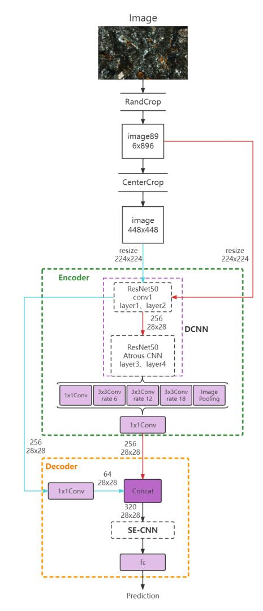

# 岩石薄片识别

## 文件架构

|

|——	base	——基础的model类

|——dataloader	——数据loader模块

|——DataSets	—— 数据库，包括分好类的图库，train和val文件

​		|——Images	——图库

​				|——classes	——粗分类（大类），只有一个分类时此处只有一个文件夹，名为classes

​						|——细分类

​		|——To-be-expanded	——待扩充的数据库，结构同ImageSets

​		|——train.txt	——由上级目录的CreateDataSet.py生成

​		|——val.txt	——由上级目录的CreateDataSet.py生成

​		|——classes.txt	——类别

|——env	——环境包

|——mymodels	——模型集
|——trained_models	——训练好的模型保存在这个文件夹

|——training_process_data	——训练过程记录的参数，json文件

|——CreateDataSet.py	——生成train.txt和val.txt文件

|——Readme.md	——描述文件

|——train.py	——训练代码

## 环境配置

- 以下命令导出环境配置

```bash
conda env export > 环境名.yaml
```

- 以下命令复制上面导出的环境

```bash
conda env create -f 环境名.yaml
```

## 模型架构



